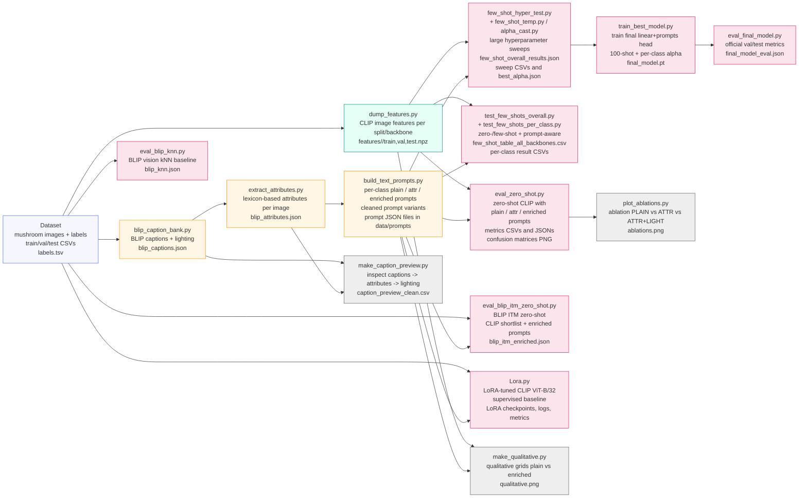

```mermaid
flowchart LR
    %% Style groups
    classDef data fill:#f6f6ff,stroke:#4c6fff,stroke-width:1px;
    classDef text fill:#fff6e6,stroke:#ff9800,stroke-width:1px;
    classDef feat fill:#e6fff6,stroke:#009688,stroke-width:1px;
    classDef model fill:#fce4ec,stroke:#e91e63,stroke-width:1px;
    classDef fig fill:#eeeeee,stroke:#616161,stroke-width:1px;

    %% 1. Dataset + splits
    A[Dataset\nmushroom images + labels\ntrain/val/test CSVs\nlabels.tsv]:::data

    %% 2. BLIP -> attributes -> prompts
    B1[blip_caption_bank.py\nBLIP captions + lighting\nblip_captions.json]:::text
    B2[extract_attributes.py\nlexicon-based attributes per image\nblip_attributes.json]:::text
    B3[build_text_prompts.py\nper-class plain / attr / enriched prompts\ncleaned prompt variants\nprompt JSON files in data/prompts]:::text

    %% 3. CLIP features
    C1[dump_features.py\nCLIP image features per split/backbone\nfeatures/<backbone>/train,val,test.npz]:::feat

    %% 3a. Zero-shot CLIP
    D1[eval_zero_shot.py\nzero-shot CLIP with\nplain / attr / enriched prompts\nmetrics CSVs and JSONs\nconfusion matrices PNG]:::model

    %% 3b. Few-shot + hypertuning + final model
    E1[test_few_shots_overall.py\n+ test_few_shots_per_class.py\nzero-/few-shot + prompt-aware\nfew_shot_table_all_backbones.csv\nper-class result CSVs]:::model
    E2[few_shot_hyper_test.py\n+ few_shot_temp.py / alpha_cast.py\nlarge hyperparameter sweeps\nfew_shot_overall_results.json\nsweep CSVs and best_alpha.json]:::model
    E3[train_best_model.py\ntrain final linear+prompts head\n100-shot + per-class alpha\nfinal_model.pt]:::model
    E4[eval_final_model.py\nofficial val/test metrics\nfinal_model_eval.json]:::model

    %% 4. BLIP + LoRA baselines
    F1[eval_blip_knn.py\nBLIP vision kNN baseline\nblip_knn.json]:::model
    F2[eval_blip_itm_zero_shot.py\nBLIP ITM zero-shot\nCLIP shortlist + enriched prompts\nblip_itm_enriched.json]:::model
    F3[Lora.py\nLoRA-tuned CLIP ViT-B/32\nsupervised baseline\nLoRA checkpoints, logs, metrics]:::model

    %% 5. Qualitative + figures
    G1[make_caption_preview.py\ninspect captions -> attributes -> lighting\ncaption_preview_clean.csv]:::fig
    G2[make_qualitative.py\nqualitative grids plain vs enriched\nqualitative.png]:::fig
    G3[plot_ablations.py\nablation PLAIN vs ATTR vs ATTR+LIGHT\nablations.png]:::fig

    %% Edges
    A --> B1 --> B2 --> B3
    A --> C1

    C1 --> D1
    B3 --> D1

    C1 --> E1
    B3 --> E1

    C1 --> E2
    B3 --> E2
    E2 --> E3 --> E4

    A --> F1
    A --> F2
    B3 --> F2
    A --> F3
    B3 --> F3

    B1 --> G1
    B2 --> G1
    C1 --> G2
    B3 --> G2
    D1 --> G3

```