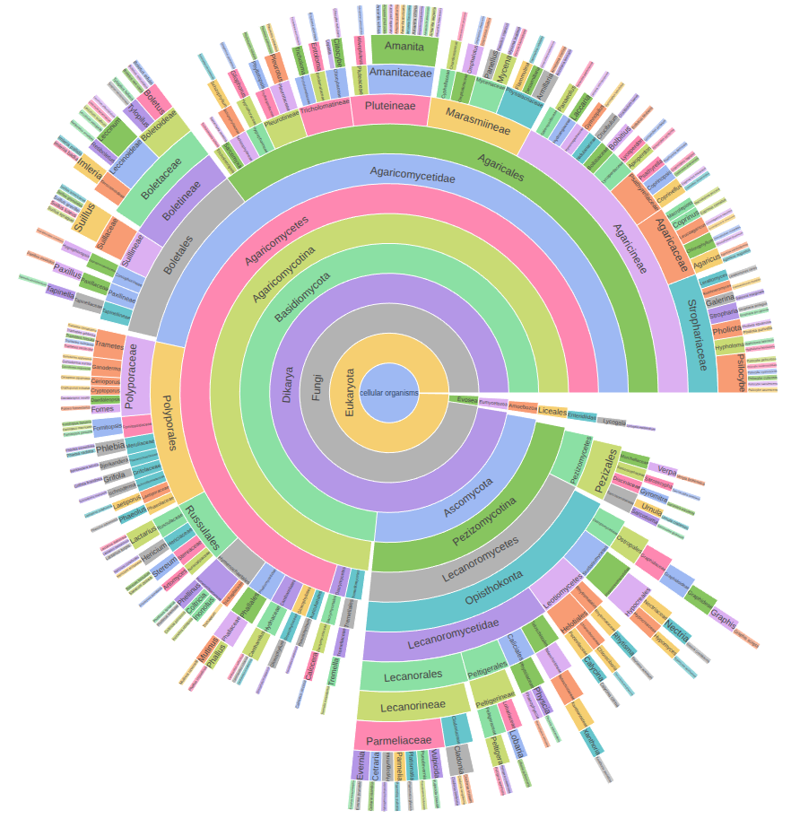

<div align="center">

# AI4GOOD Class Fall 2025 - Fine-grained mushroom classification

<a href="https://pytorch.org/get-started/locally/"></a>
<a href="https://pytorchlightning.ai/"></a>
<a href="https://hydra.cc/"></a>
<a href="https://github.com/ashleve/lightning-hydra-template"></a>
[](https://www.kaggle.com/datasets/zlatan599/mushroom1)

</div>

<p align="center">
  
</p>

## 📌 1. Presentation of the problem

**Mushrooms** are vital to ecosystems, recycling nutrients, supporting plants, 
and serving as indicators of environmental health. Yet, their enormous diversity 
makes species identification difficult, especially since many species look very 
similar. **Accurate classification** is important for biodiversity conservation, 
safe foraging, and raising ecological awareness. 

In this project, we will use a 
[public kaggle dataset](https://www.kaggle.com/datasets/zlatan599/mushroom1) 
for **fine-grained image classification across 169 mushroom species**. The 
dataset has already been prepared in train/val/test splits. The official train 
dataset is **balanced** and contains **4080 images for each class**. 

We prepared a codebase and baseline models addressing this task.

<br>


## 🎯 2. Objectives 

### 📈 2.1 Metrics

We will use several metrics to assess model performance on this fine-grained 
multi-class classification problem.

#### OA - Overall Accuracy

We use Overall Accuracy, or micro-averaged accuracy to capture the percentage of
correct predictions. _Overall, how often is our model correct?_ This is defined 
by:

$$\frac{\text{True Positives}}{\text{Total number of points}}$$

But this metric fails to capture per-class subtleties and, if a class is 
under-represented in the dataset, the OA will not be very sensitive to its 
classification performance.

#### mF1 - macro F1

This is the macro averaged (i.e. mean over classes) F1 score. This is the mean 
of per-class F1 scores. 
Contrary to OA, it gives the same importance to each class, regardless of its 
prevalence in the dataset. 

$$\frac{1}{|C|} \sum_{c \in C} \frac{2 \times \text{True Positives}_c}{ 2 \times \text{True Positives}_c + \text{False Positives}_c + \text{False Negatives}_c }$$

#### mIoU - macro Jaccard Index

This computes the macro averaged Jaccard index, or mean Intersection over Union.
It is similar to the mF1 but even less permissive:

$$\frac{1}{|C|} \sum_{c \in C} \frac{\text{True Positives}_c}{\text{True Positives}_c + \text{False Positives}_c + \text{False Negatives}_c }$$

**Because this is the hardest objective to maximize, we will use mIoU as our 
main metric.**

### 🥇 2.2 Baseline models

We pretrained several ResNet baselines on the dataset. All our pretrained models 
can be found on the IMath servers in the 
`/zfs/ai4good/datasets/mushroom/baselines/` directory. We summarize the metric
performance of each model in the following table.

| Model      | Test mIoU | Test mF1 | Test OA | Training time on IMath | Which files ?                 |
|:----------:|:---------:|:--------:|:-------:|:----------------------:|:------------------------------|
| ResNet18   |   69.0    |   80.8   |  85.1   |          3h05          | `resnet18.ckpt`   |
| ResNet34   |   70.4    |   81.7   |  85.8   |          5h33          | `resnet34.ckpt`   |
| ResNet50   |   73.4    |   84.0   |  87.4   |          8h42          | `resnet50.ckpt`   |
| ResNet101  |   75.2    |   85.1   |  88.4   |         16h43          | `resnet101.ckpt`  |
| ResNet152  |   75.3    |   85.1   |  88.3   |         17h57          | `resnet152.ckpt`  |

See [below](#-41-running-the-code) for how to reproduce our baseline experiments and
use our pretrained models.

### 🥷 2.3 Your mission

We foresee several potential directions for building upon this framework:

- **improving model performance** on the task at hand: improving the backbone,
improving the training recipe, leveraging pretrained models, etc.
- exploring the **inter-class structures** in the context of fine-grained 
classification. Some classes are more similar than other, and we might want to 
enforce such a hierarchical structure (e.g., taxonomic, phylogenetic, etc.) in 
the learning framework to improve results or control errors (e.g., poisonous vs 
edible). [Suggested read](https://arxiv.org/abs/2007.03047).
- exploring **imbalanced, few-shot, or zero-shot mushroom species 
identification**.
How would the model perform on an (artificially) imbalanced training dataset?
Can we characterize a new species with only a few images? 
Can we identify if a species is outside the current set of known species?
Can we use pretrained vision-language models (VLMs) to identify a species 
without any training?
- **extending the training dataset** or aligning it with **additional modalities** 
([GBIF geolocalized observations](https://www.gbif.org),
[iNaturalist](https://www.inaturalist.org),
[wikipedia text embedding](https://arxiv.org/abs/2504.19742v1), 
...).

<p align="center">
  
</p>

For instance, here is the taxonomic structure linking species in the dataset.
This tree hierarchy could be leveraged for the species identification task.
An interactive version of this figure can also be found 
[here](media/mushroom_taxonomy.html) (open with your browser). We also provided
a [notebook](notebooks/taxonomic_graph.ipynb) for reproducing this graph and 
help you get started.

<br>


## 📦 3. Installation 

**📠 Hardware requirements**: 30GB SSD disk space, 32GB RAM, a GPU with CUDA 12.

> [!TIP]
> We have prepared servers for you on the **UZH IMath cluster** which (by far) 
> satisfy the hardware requirements. Each student group will be given exclusive 
> access, for the whole duration of the course, to a compute node with 64 CPUs, 
> 512GB RAM, a 7TB disk, and a 48GB L40S GPU.
> The following servers are exclusively reserved for the mushroom classification
> project groups:
> ```bash
> ribeiro    # mushroom group 1
> sushko     # mushroom group 2
> ```

**👩‍💻 Software requirements**: A 
[miniconda](https://www.anaconda.com/docs/getting-started/miniconda/main) 
installation, 
a [github](https://github.com) account and 
a [wandb](https://wandb.ai/home) account.

> [!TIP]
> You may want to use the **same wandb account for all group members**, 
> this will let you log the results of your experiment to a shared platform.

### 🐍 3.1 Code and Python environment preparation

Fork the code to your own github account and clone it to your machine. 
Create a `mushroom` conda environment with the prepared dependencies.

```bash
# clone your fork of the project
git clone git@github.com:your-account/ai4good_mushroom.git
cd ai4good_mushroom

# create conda environment and install dependencies
conda env create -f environment.yaml -n mushroom

# activate conda environment
conda activate mushroom
```

> [!TIP]
> You may want to use the **same fork of the project for all group members**. 
> This way, you can collaboratively work on the code using git.

### 💽 3.2 Dataset preparation

The dataset is publicly available on
[kaggle](https://www.kaggle.com/datasets/zlatan599/mushroom1/data).

> [!TIP]
> We already downloaded the datasets to `/zfs/ai4good/datasets/mushroom` on the 
> IMath servers. So, unless you work on another machine, you won't need to 
> download the dataset.

### 🗺️ 3.3 Local paths

The codebase expects your dataset and experiment logs to be in the 
[`data/`](data) and [`logs/`](logs) directories of the project root. 
In practice, we usually prefer having our data stored elsewhere on a machine, 
for better usage of disk partitions and to share data across projects. To let
the codebase know where your data and logs should actually be found, create a 
new `configs/local/default.yaml` file containing:

```yaml
# @package paths

# path to data directory
data_dir: /zfs/ai4good/datasets/mushroom

# path to logging directory
log_dir: /zfs/ai4good/logs/mushroom
```

These are the paths for working on the IMath server. If you are working on 
another machine, adjust these paths to your liking.

<br>

## 🚀 4. Usage

The provided codebase is built on the 
[lightning-hydra template](https://github.com/ashleve/lightning-hydra-template).
This project structure makes use of two important frameworks that greatly 
facilitate modular deep learning experimentation.

[PyTorch Lightning](https://github.com/PyTorchLightning/pytorch-lightning) - a lightweight PyTorch wrapper for high-performance 
AI research. Think of it as a framework for organizing your PyTorch code.

[Hydra](https://github.com/facebookresearch/hydra) - a framework for elegantly configuring complex applications. 
The key feature is the ability to dynamically create a hierarchical 
configuration by composition and override it through config files and the 
command line. Think of it as object-oriented configs in the form of yaml files.

### 👩‍💻 4.1 Running the code

Train model with default configuration defined in 
[train.yaml](configs/train.yaml)

```bash
# train using the default config defined by config/train.yaml
python src/train.py
```

You may specify experiment configs which overwrite some of the default config 
settings. These can be found in [configs/experiment/](configs/experiment/). You
can find there the configuration we used to train our baseline models.

```bash
# reproduce our baseline training
python src/train.py experiment=baseline
```

More generally, you can override any configuration parameter directly from the 
command line like this

```bash
# override config parameters directly from the command line
python src/train.py trainer.max_epochs=2 data.batch_size=64 model.optimizer.lr=0.1
```

Hydra even lets you launch multiple runs on an array of values for any parameter

```bash
# launch multiple consecutive experiment exploring a set of parameter values  
python src/train.py --multirun data.image_size=224,384 model=resnet18,resnet50
```

> [!WARNING]
> `--multirun` will explore the cartesian product of the passed values, beware 
> of the combinatorial explosion 😉

More generally, you may want to create your own configs in [configs/](configs/)
rather than always defining things from the command line. Have a look at the 
structure of the existing configs to understand how to extend it to your needs.

We also provide a script for only evaluating an already-trained model

```bash
# evaluate your model
python src/eval.py ckpt_path=/path/to/your/checkpoint.ckpt

# evaluate our pretrained ResNet models
MODEL_ROOT=/zfs/ai4good/datasets/mushroom/baselines/
python experiment=baseline model=resnet18 $MODEL_ROOT/resnet18.ckpt
python experiment=baseline model=resnet34 $MODEL_ROOT/resnet34.ckpt
python experiment=baseline model=resnet50 $MODEL_ROOT/resnet50.ckpt
python experiment=baseline model=resnet101 $MODEL_ROOT/resnet101.ckpt
python experiment=baseline model=resnet152 $MODEL_ROOT/resnet152.ckpt
```

> [!TIP]
> We already placed the `.ckpt` files of our baseline ResNet models in 
> `/zfs/ai4good/datasets/mushroom/baselines`.


### ⚡ 4.2 Fast experimentation

Our baseline models have been trained on the whole dataset for 20 epochs, and it 
is likely that even longer trainings would yield higher metric performance. Yet, 
experiments such as ResNet152 training for 20 epochs took 18 hours on the IMath 
cluster. In practice, you may want to work on smaller experiments to be able to 
iterate faster and make better use of the available compute.

To this end, here are some hyperparameters you can play with:
- `data.mini` - number of training images per class (default is 4080). 
Reducing makes epochs faster, but with fewer training steps
- `data.image_size` - the size of the image models are trained on. 
Reducing saves compute and memory, but may discard details and textures
- `data.batch_size` - number of images in each batch. 
Reducing makes batch construction faster but increases the number of 
training steps per epoch
- `trainer.max_epochs` - number of training epochs. 
Reducing makes the training faster but may not let the model fully converge
- `model.net` - model backbone. We implemented ResNet18, ResNet34, ResNet50, 
ResNet101, ResNet152.
- As illustrated by our [baseline experiments](#-22-baseline-models), the smaller 
the model, the faster the training, but the lower the performance.

### 📜 4.3 Logging

The codebase is configured to make use of [wandb](https://wandb.ai/home) for
tracking the experiments. This is a webserver where you can log and compare your
trainings. You can easily extend the logs with more metrics, illustrations, etc.

### 🔩 4.4 Code structure

<details>
<summary><b>Project directory structure.</b></summary>

```
├── configs                   <- Hydra configs
│   ├── callbacks                <- Callbacks configs
│   ├── data                     <- Data configs
│   ├── debug                    <- Debugging configs
│   ├── experiment               <- Experiment configs
│   ├── extras                   <- Extra utilities configs
│   ├── hparams_search           <- Hyperparameter search configs
│   ├── hydra                    <- Hydra configs
│   ├── local                    <- Local configs
│   ├── logger                   <- Logger configs
│   ├── model                    <- Model configs
│   ├── paths                    <- Project paths configs
│   ├── trainer                  <- Trainer configs
│   │
│   ├── eval.yaml             <- Main config for evaluation
│   └── train.yaml            <- Main config for training
│
├── data                   <- Project data
│
├── logs                   <- Logs generated by hydra and lightning loggers
│
├── media                  <- Media files for the project: images, htmls, ...
│
├── notebooks              <- Jupyter notebooks
│
├── scripts                <- Shell scripts
│
├── src                    <- Source code
│   ├── data                     <- Data scripts
│   ├── models                   <- Model scripts
│   ├── utils                    <- Utility scripts
│   │
│   ├── eval.py                  <- Run evaluation
│   └── train.py                 <- Run training
│
├── .env.example              <- Example of file for storing private environment variables
├── .gitignore                <- List of files ignored by git
├── .project-root             <- File for inferring the position of project root directory
├── environment.yaml          <- File for installing conda environment
└── README.md
```

<br>
</details>

### 📔 4.5 Jupyter notebooks

We provided some [notebooks](notebooks) to help you get started with the 
codebase. [demo.ipynb](notebooks/demo.ipynb) shows how to instantiate a 
datamodule and a model using hydra in a notebook. 
[taxonomic_graph.ipynb](notebooks/taxonomic_graph.ipynb) shows how to make the 
taxonomic tree figure.

<br>

## 💳 5. Credits

This project was implemented using the
[lightning-hydra template](https://github.com/ashleve/lightning-hydra-template)
by Lukasz Zalewski
and the 
[Mushroom species recognition](https://www.kaggle.com/datasets/zlatan599/mushroom1/data) 
dataset by Leonardo Cofone.
